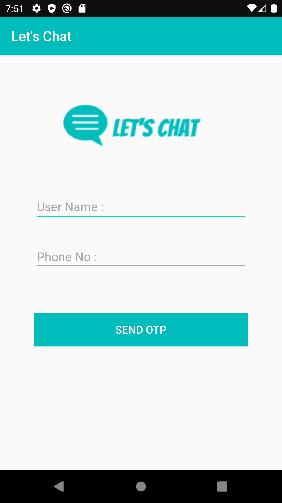
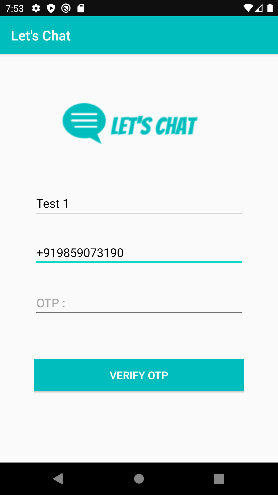
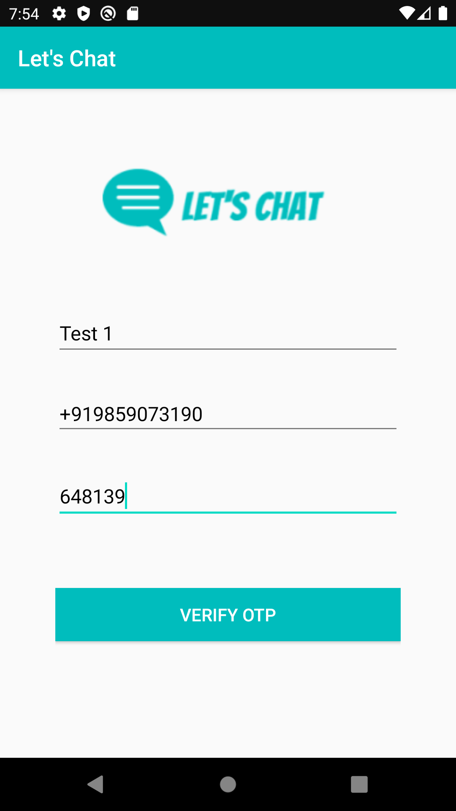
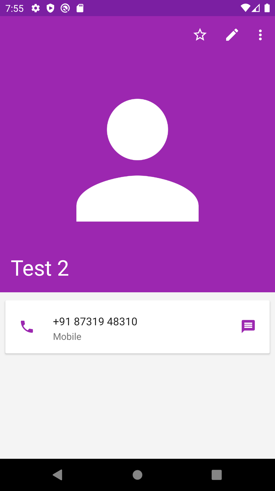
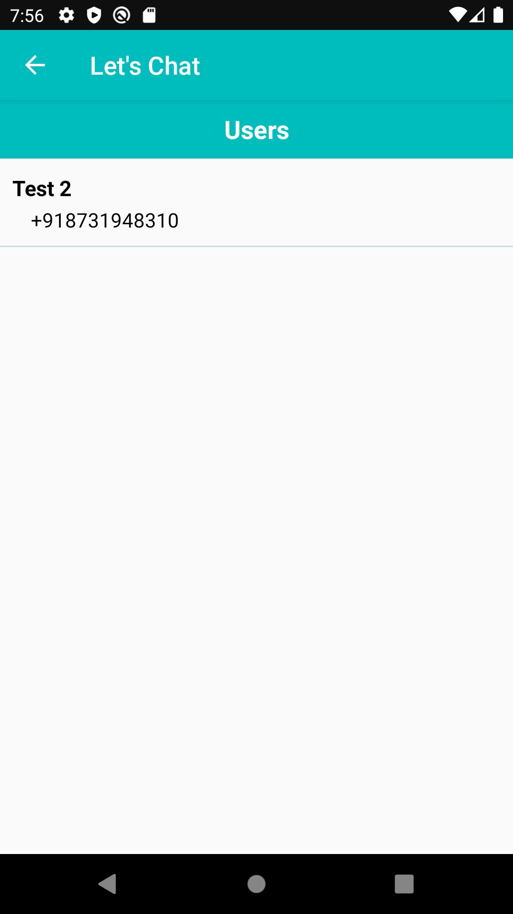
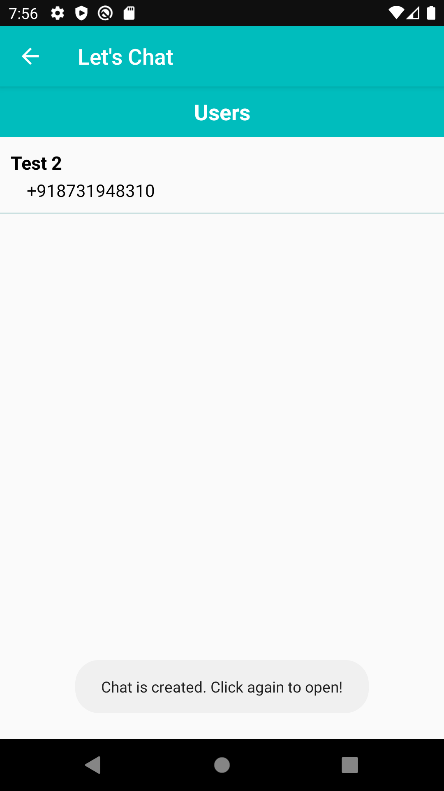
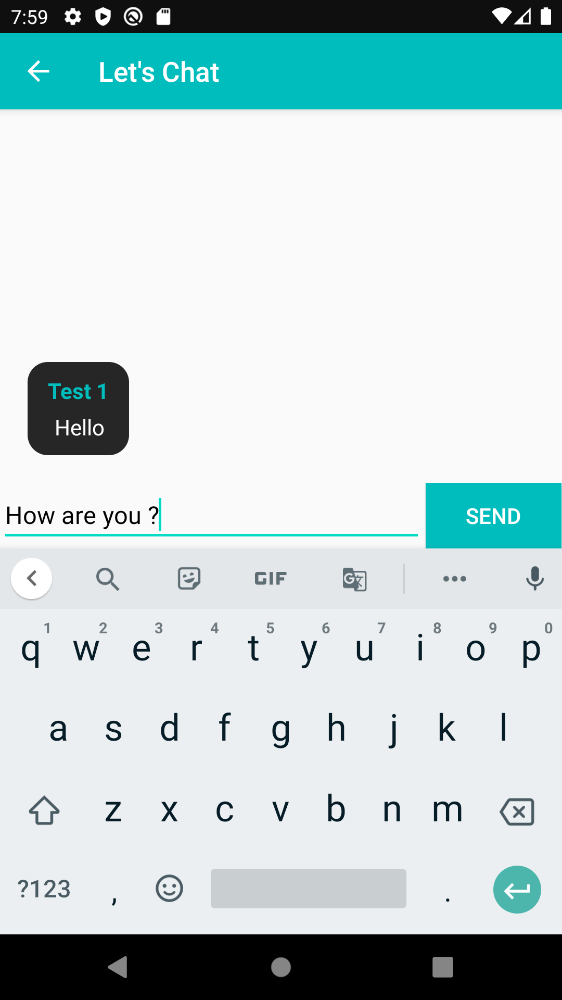
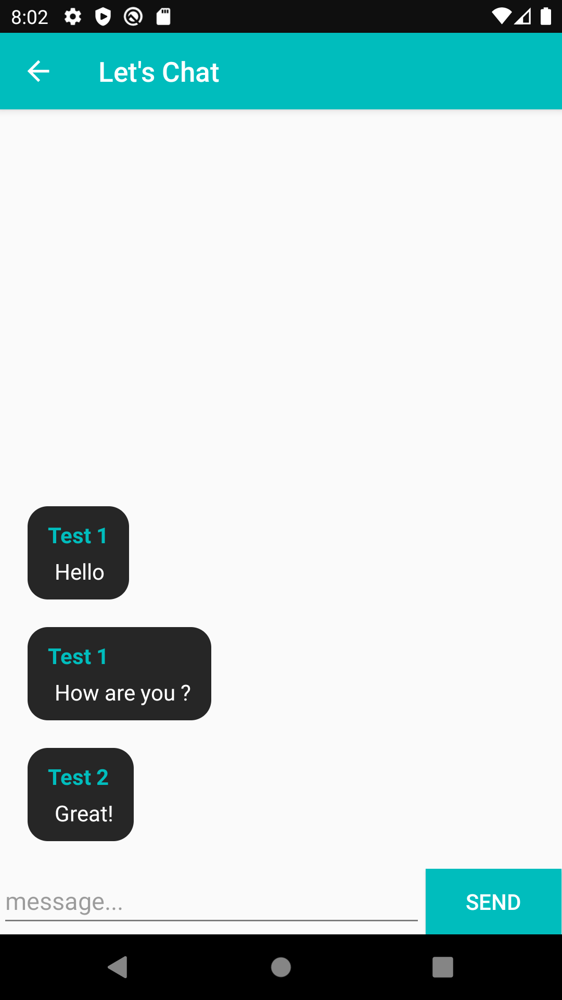

# LetsChat
A real time android chat application made in Android Studio and Firebase, to connect with people and chatting. This app allows phone authentication through which user can sign in with their phone
number.

## Screenshots

### Login Page
    

### Chat
    
 

